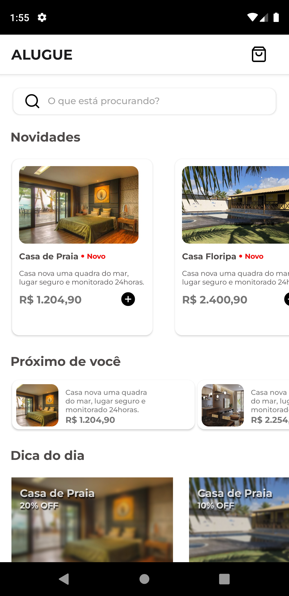
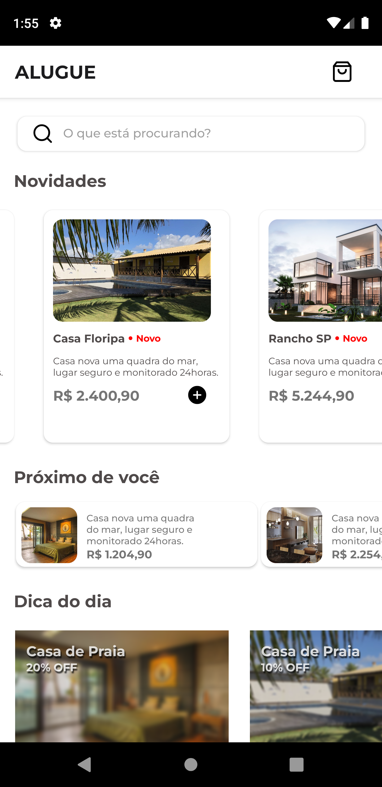
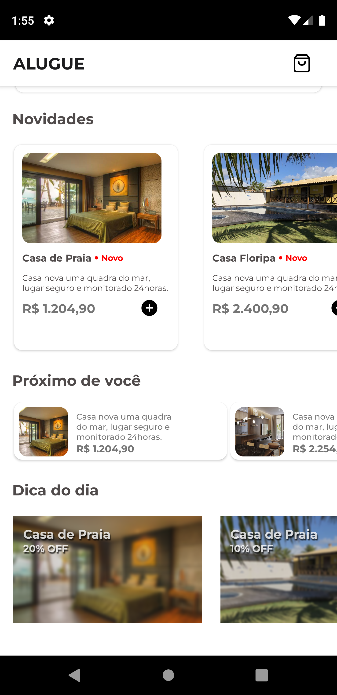
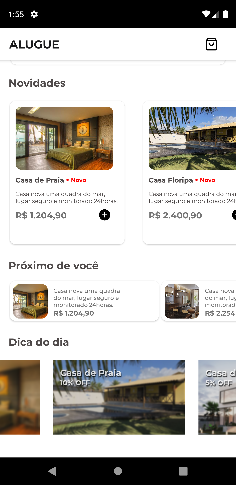
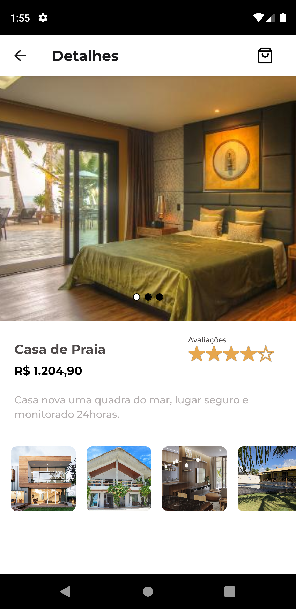
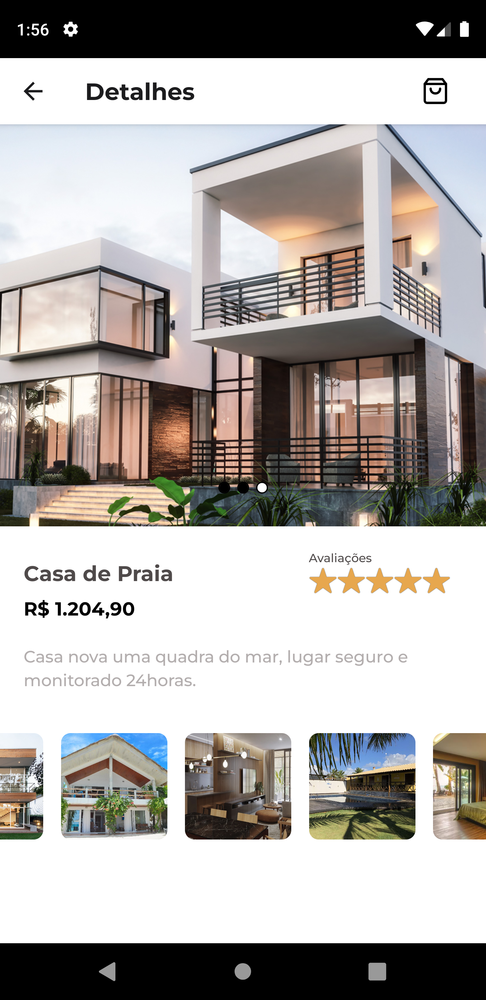

# Alugue

### Projeto de Aluguel de casa e afins desenvolvido em React Native para Android e iOS.

### Como usar

Baixe o projeto, na pasta do projeto rode o comando '''yarn install''' para instalar as dependências do projeto npx react-native run-android ou react-native run-android.

 

